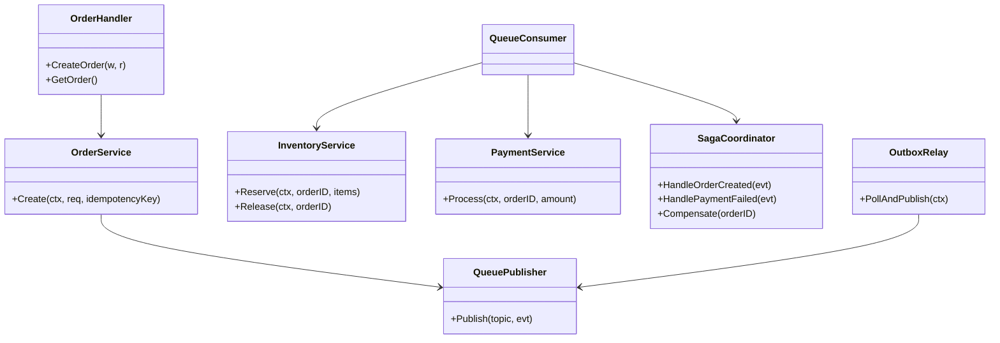

# 03 - Design & Plan

## 3.1 Arsitektur

[Client] --REST--> [Order API Go/Chi] --(TX orders+outbox)--> [Postgres]
  | publish via relay --> [Kafka/Redpanda] --> Inventory Consumer / Payment Consumer / Saga Orchestrator
  Redis: lock + rate limit + idempotency cache. Prometheus + OTEL observability.

## 3.2 Class Diagram (Go packages, mermaid)



## 3.3 Sequence Diagram

```mermaid
sequenceDiagram
participant C as Client
participant API as Order API
participant PG as Postgres
participant Relay as Outbox Relay
participant K as Kafka
participant INV as Inventory
participant PAY as Payment
participant SAGA as Saga
C->>API: POST /orders + Idempotency-Key
API->>PG: BEGIN; INSERT orders; INSERT outbox(OrderCreated); COMMIT
API-->>C: 201 pending
Relay->>PG: SELECT outbox pending FOR UPDATE SKIP LOCKED
Relay->>K: publish OrderCreated
Relay->>PG: UPDATE outbox published
K-->>INV: consume OrderCreated
INV->>PG: UPDATE inventory stock- qty WHERE stock>=qty
INV->>K: publish InventoryReserved/Failed
K-->>PAY: consume InventoryReserved
PAY->>PG: INSERT payments success
PAY->>K: publish PaymentSucceeded/Failed
K-->>SAGA: consume result
SAGA->>PG: UPDATE orders confirmed/cancelled + compensate release
```

## 3.4 DB Schema
Lihat migrations/000001_init.sql. ERD: orders 1--* order_items, orders 1--1 payments, orders 1--* outbox.

## 3.5 API Spec

POST /api/v1/orders (Header Idempotency-Key) Body {items:[{product_id,qty}]}
GET /api/v1/orders/:id
GET /healthz
GET /metrics

Idempotency: key ada -> return cached response tanpa side effect baru.
Rate limit: 100 req/min IP, 429 + Retry-After.

## 3.6 Kafka Topics
order.created, inventory.reserved/failed, payment.succeeded/failed, order.cancelled, *.dlq

## 3.7 Struktur Folder
/cmd/api /cmd/relay /cmd/worker /internal/order /inventory /payment /saga /platform/postgres,redis,kafka,outbox,httpx,middleware /migrations /deploy
Rule: handler -> service -> repo -> DB. Interface Publisher + Locker untuk mock test.
